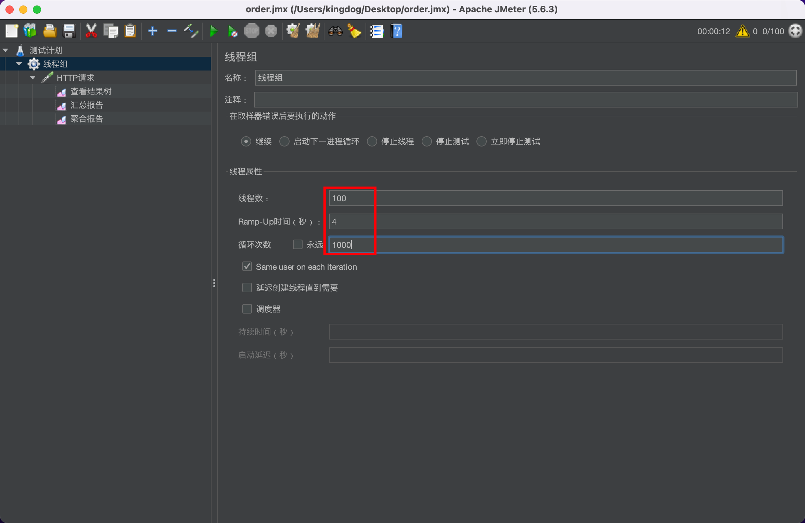
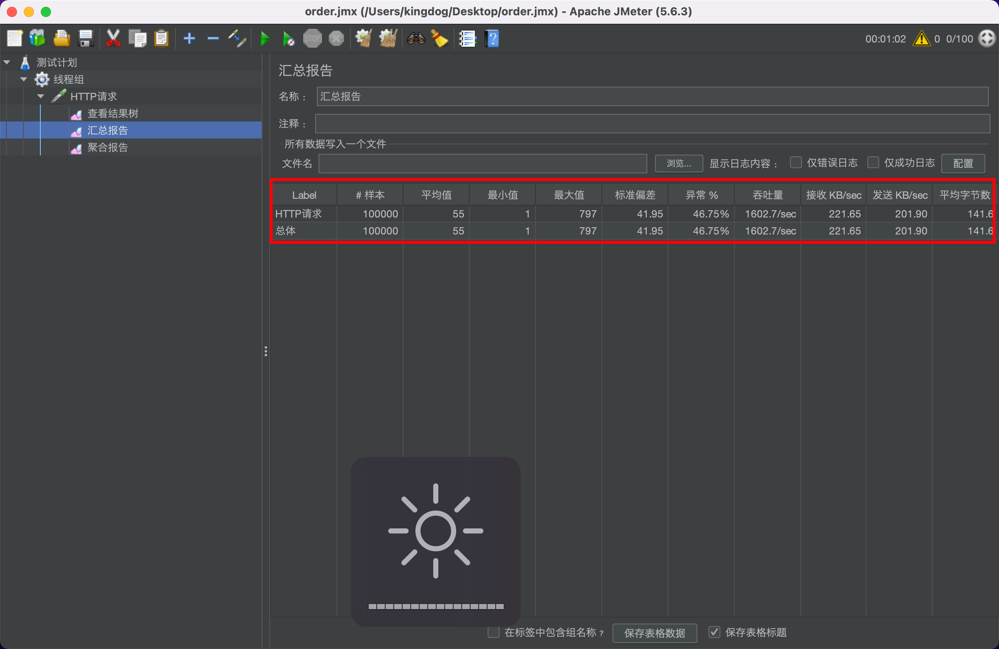
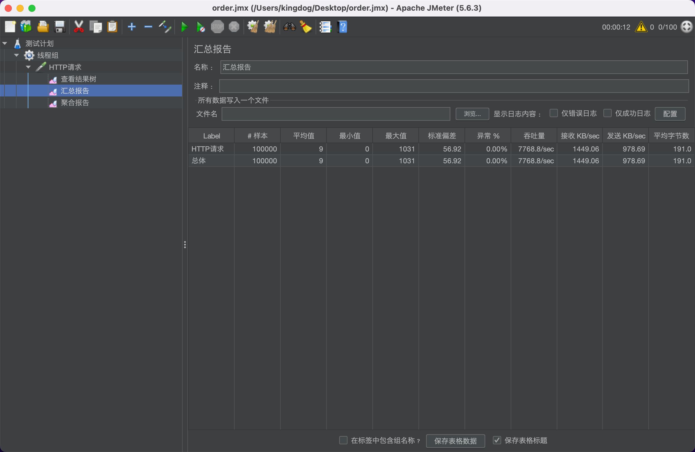

# 异步下单

## 方案：

生产者把消息写入kafka后返回下单成功
消费者从kafka批量读取消息，批量入库，将多个db的写请求聚合成一个来降低db压力

## Q&A

- **为什么需要异步下单？**

1. 因为下单量过大，DB主库写入压力大，需要降低DB的压力
2. 通过kafka的消费者端批量拉取消息，将消息聚合成一批一次写入db，降低db压力

-  **怎么保证消息消费的幂等性?**

1. （这个场景对重复消费是比较敏感的，对重复消费的容忍率比较低）
2. 单纯使用redis做幂等标记是不可靠的，假如消费者读取到消息，写库成功还没来得及ack就宕机，在kafka眼中这条消息还没被消费，服务器重启后会重新拉取，而Redis中的幂等标识已经失效，这样就会重复消费
3. db中有一个记录表，记录订单周期中重要的操作记录，比如下单，发货，收货... 根据这个操作有一个唯一索引，插入时会报错，这样保证强一致性

ps: 因为消息是批量插入的，如果一个订单重复，这一批订单都会报错，所以对唯一索引作特殊判断，假如报了这个错，就查一遍db，过滤掉重复的订单再次执行插入

- **消息消费失败怎么办？**

1. 投递到重试队列中等待再次消费，超过次数的话就告警 + 投入死信队列，死信队列中写db做现场保留
2. 重试队列和死信队列的消费比率要比正式队列慢一些，partition也要少一些，防止影响正常业务 （这块代码懒得写了，懂意思就行）

- **为什么不使用canal？**

增加系统复杂度和运维成本，降低系统可用性，假如canal承受不住这么大的流量压力系统也会出问题

- **消费者ack怎么做的？**
  TODO

## 同步 vs 异步

jmeter压测：

### 同步

下单接口：

在并发量特别大的情况下，产生了大量报错： too many connections
原本10w个请求，只落库5w记录左右

### 异步

下单接口：

吞吐量上升明显
10w请求，落库9.5w多，错误率明显降低
再通过重试，订单可以做到几乎百分百消费

ps:

1. kafka消费者拉取消息的参数需要根据线上流量逐步调试，否则db仍然很容易被打爆
2. 一开始我设置的kafka客户端缓存数据大小为200(QueueCapacity为200)，批量写库的大小为10(batchSize), concurrency大小为20，但是写库频率还是太高，错误率和同步下单差不多，也一直报too many connections，排查半天发现需要修改这些参数，结果压测不断测试改成现在的配置
3. 那假如把这些值设置非常高有什么坏处？ 服务器内存占用会上升，所以不能无限调大
4. 近一步提高吞吐量应该多协程拉取kafka消息，多协程消费，实际上也应该多协程消费，这样有需要修改那些数值这里偷懒没写

## 系统数据

TODO
qps
服务器cpu
服务器内存
db cpu

消费速度

## 其他方案

下单后将订单数据放在缓存，后续
