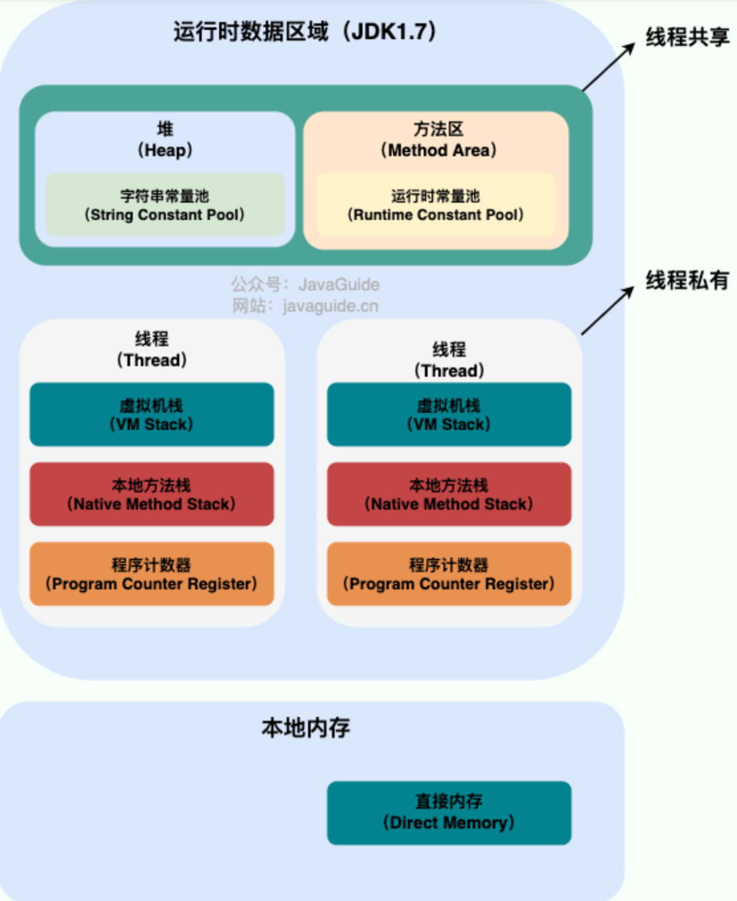

# 字节码

## 字节码文件里有什么？

- 魔数
- 版本号
- 常量池计数器
- 常量池
- 当前类的各种信息： 类名、继承的类、实现的接口、方法、字段....

## 字节码文件加载过程

1. 加载: 将class文件加载到内存中(堆区、类的元数据：类的方法代码，变量名，方法名在方法区)，生成一个class对象(堆区：用于反射)，作为这个类的访问的入口
2. 链接: 验证(检查class文件是否合法，比如魔数、版本号)、准备(static变量进行赋0值，final除外,final这里直接赋值)、解析(符号引用转化为直接引用)
3. 初始化(执行clinit方法)
4. 使用
5. 类的卸载(不再被引用)

## 运行时内存
