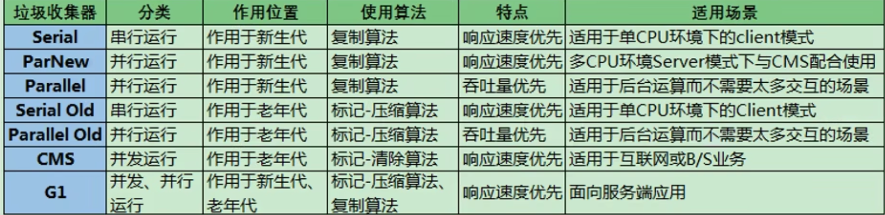

# 垃圾回收

## 垃圾回收器

### serial

### parallel
两大特点：
1. 吞吐量优先
2. 默认启用自适应调节策略，根据监控动态调整老年代、新生代大小，进入老年代大对象的大小等等数据，很多参数就不用手动设置了：比如 eden: s1: s2 本来是8:1:1，但是程序刚启动不一定是这个值，可能是6:1:1

### parnew

### CMS
低延迟，缺点是额外线程回收垃圾，占用cpu资源导致吞吐量下降

### G1
在**可预测**的延迟时间下，尽可能提高吞吐量，比较全能的垃圾回收器

TODO 指针碰撞、空闲链表