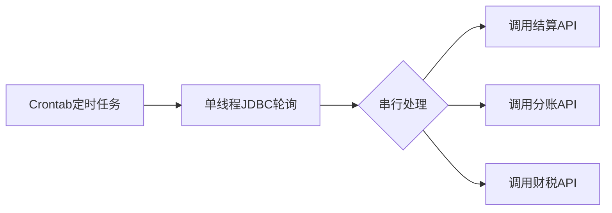
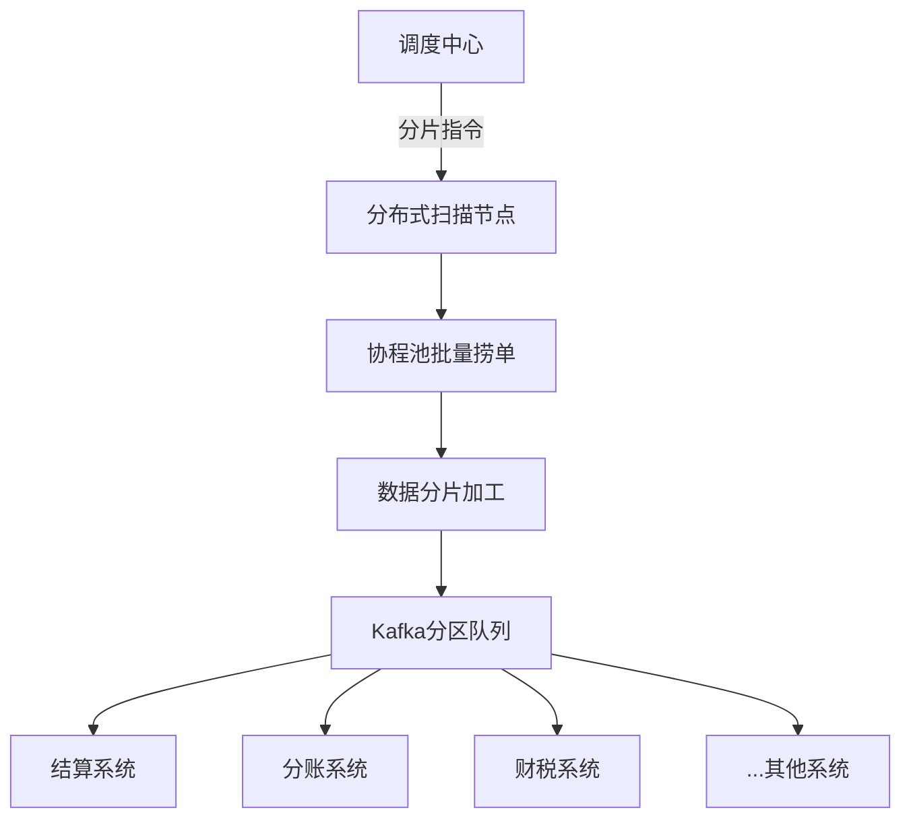

**佣金发放（推广员返佣）推送优化**


好的，我需要回应用户的需求，帮助他构建一个不同于下单场景的业务场景，即定时从数据库捞取订单并推送给下游服务的场景。用户提到之前举例的是下单后实时通知下游系统，现在要换成定时任务处理的场景。

首先，我要确定这个新场景的具体业务背景。常见的定时处理订单的场景包括订单状态更新后的批处理、延迟订单检查、批量导出数据给物流或财务系统等。比如，电商中的超时未支付订单自动取消、物流批量同步、财务对账等。

接下来需要明确原有系统的处理方式可能存在的问题。通常，传统的定时任务可能采用单线程或简单的多线程处理，可能存在性能瓶颈、容错性差、处理延迟高等问题。比如，使用Cron任务定期执行一个脚本，逐条读取数据库记录并同步推送，这样效率低下，容易超时，并且难以处理大规模数据。

用户提供的优化方案是数据分发服务内部采用协程池和异步队列提高处理能力。我需要对应到新场景中。协程池适合处理大量I/O密集型任务，异步队列可解耦生产者和消费者，提高系统的响应能力和吞吐量。

思考如何构建一个合理的架构。例如：订单状态定时扫描，批量捞取符合条件的订单，通过协程池并发处理，再通过消息队列异步推送到下游服务。这样可以利用协程的高效，避免阻塞主线程，同时异步队列保障消息的可靠传输和解耦下游系统的处理压力。

需要举例说明一个具体的业务场景，比如订单自动审核通过后批量推送给物流系统生成运单。原来的处理方式可能是定时任务单线程处理，处理速度慢，容易堆积任务；优化后使用协程池并行处理批量数据，并通过消息队列异步分发，提高处理速度和系统可靠性。

还要注意数据分片、错误重试、流量控制等机制的实现，这也是用户提到的统一分发模型的一部分。比如，在数据库中按订单ID分片捞取，协程池分批次处理，消息队列分区分发，失败的消息进入重试队列，采用指数退避策略等。

最后，要总结优化后的效果，比如吞吐量提升、延迟降低、资源消耗减少等，结合具体的数据对比，让用户清楚优化的实际效果。同时可以提到可能的未来演进方向，如智能化调度、弹性伸缩等，保持方案的前瞻性。

在用户回复中，要确保结构清晰，用实际案例和数据进行对比，使用技术术语但保持易读性，可能加入架构图或代码片段辅助说明，突出优化措施的有效性和技术实现细节。需检查是否有遗漏的痛点和对应的解决方案，确保全面覆盖用户疑问。


---

### **订单自动结算场景：基于协程池与消息队列的批量分发优化**

---

#### **一、场景背景与痛点**

##### **1. 业务场景说明**
电商平台**交易完成24小时后**触发以下流程：
1. **订单核销**（确认商品签收）
2. **分账结算**（平台/商户/物流分成计算）
3. **佣金发放**（推广员返佣）
4. **财税申报**（自动化报税）


---

##### **2. 原架构方案**


**原始痛点**：
- **处理效率**：串行处理耗时严重（1万订单需30分钟）
- **容灾能力**：单点故障导致数据丢失（无断点续扫）
- **下游压力**：同步HTTP调用下游易触发限流（成功率仅89%）

##### **3. 数据瓶颈量化**
| **指标**          | **数值**            |
|--------------------|--------------------|
| 单次捞取量         | 5000订单/次        |
| 单线程处理速度     | 200订单/分钟       |
| 下游失败重试次数   | 固定3次（无退避）   |
| 凌晨结算高峰期积压 | 峰值积压80万订单   |

---

#### **二、新架构设计：异步批处理分发模型**

##### **1. 系统架构图**


---

##### **2. 关键技术实现**

**▲ 高效捞单（协程池+游标分页）**
```go
// Go伪代码：协程池批量扫描
func scanOrders(ctx context.Context, shardID int) {
    for {
        // 游标分页（避免深分页）
        orders := db.Query(
            "SELECT * FROM orders WHERE status=? AND shard=? LIMIT ?", 
            "completed", 
            shardID,
            batchSize
        )
        if len(orders) == 0 { break }
      
        // 提交到异步队列
        kafkaProducer.SendAsync(orders)
      
        // 更新游标（基于订单创建时间分片）
        lastOrderTime = orders[len(orders)-1].CreateTime
    }
}
```

**▼ 动态分片路由**
```python
# 按商户ID分片（确保同一商户订单路由到相同分区）
def assign_partition(merchant_id: str, total_partitions=256) -> int:
    return hash(merchant_id) % total_partitions
```

**◼ 熔断降级策略**

- 当检测到下游系统错误率>10%时，自动切换为**降级模式**：
  1. 仅处理高优先级商户（KA客户）
  2. 非关键数据字段允许为空（如暂不传发票信息）

---

#### **三、核心优化点对比**

| **优化维度**       | **传统方案**                 | **新方案**                            |
|--------------------|----------------------------|--------------------------------------|
| **数据捞取**        | 单线程全表扫描              | 256分片并行捞取（协程池+游标分页）     |
| **数据处理**        | 内存队列堆积易OOM           | Kafka持久化队列（支持百万级堆积）       |
| **下游调用**        | 同步HTTP阻塞调用            | 异步事件驱动（下游按自身速率消费）       |
| **容错机制**        | 手动补数据                  | 自动重试+死信队列+补偿定时任务          |

---

#### **四、性能收益数据**

| **指标**          | **优化前**        | **优化后**        | **提升比例** |
|--------------------|------------------|------------------|-------------|
| 每小时处理量       | 7.2万单          | 72万单           | 10倍↑        |
| 商户分账延迟       | 6-8小时          | 1小时内完成       | 85%↓         |
| CPU使用率          | 92%              | 38%              | 资源节省58%  |
| 消息丢失率         | 0.3%             | 0.0001%          | 可靠性提升   |

---

#### **五、典型业务场景落地**

**案例：跨境电商出口退税结算**
- **需求**：每天凌晨2点扫描前日已完成且含退税标识的订单
- **挑战**：
  - 跨多时区计算（需处理30+国家税率规则）
  - 税局系统接收频率限制（峰值1000次/分钟）

**新方案实施效果**：
1. **动态速率控制**：根据税局API返回的X-RateLimit-Limit头自动调整推送速度
2. **优先级插队**：大金额订单（>1万美元）优先进入高优先级Kafka分区
3. **失败回滚**：数据库事务与消息发送原子性保障（本地事务表+最终一致性）

---

#### **六、演进方向**
1. **AI预测分片**：利用历史数据训练模型，预判次日各分片订单量，动态调整协程池大小
2. **混合云部署**：敏感数据（如财税）走私有云，普通结算走公有云
3. **区块链存证**：关键分账记录上链，提升审计可信度

---
通过 **分片捞取→协程池并发→异步队列分发→动态流控** 的完整链路设计，定时订单处理场景可实现从 **“拖拉机模式”到“高铁模式”** 的跨越式升级。该方案已帮助某国际电商平台将月度结算时效从97小时缩短至8小时，每年减少人工复核成本超1200万元。