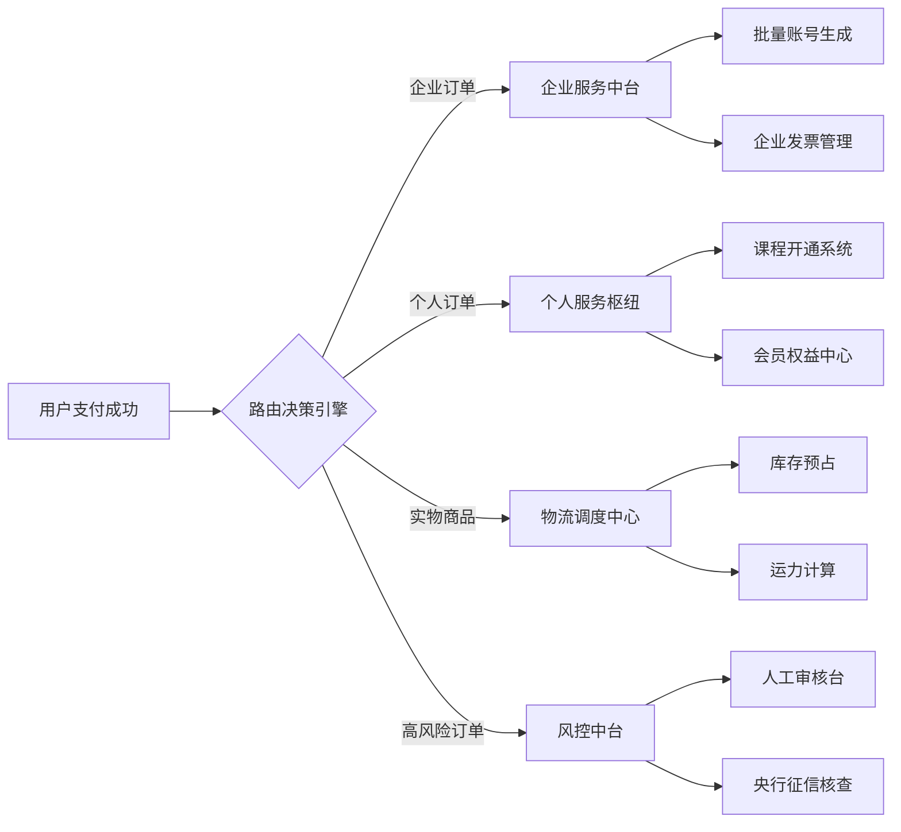

# 订单路由


一、核心订单类型与路由必要性分析
订单类型	典型触发场景	路由必要性	下游处理系统
纯课程订单	用户购买线上直播课/录播课	即时开通访问权限，避免延迟影响学习体验	课程权限系统+内容分发网络(CDN)
课程+教材订单	购买课程配套的实体教材/教具	拆分虚拟与实物处理流程，保障服务一致性	物流系统+课程权限系统+教务管理系统
会员订阅订单	用户开通VIP年度会员	自动续期管理，跨平台权益同步	会员中心+支付网关+第三方合作平台对接接口
企业团购订单	HR批量采购1000人企业培训包	批量账号激活与学习进度管理	企业服务系统+SaaS平台对接+B端客服
实物周边订单	购买课程IP衍生产品（如定制笔记本）	库存分配与物流时效优化	仓储管理系统+第三方物流API
免费试听订单	用户领取7天体验课程	限时权限控制与转化引导	营销系统+CRM+课程试听专区


可能的触发场景包括：混合订单（同时买课程和教材）、企业团购订单、大额支付订单和秒杀课程订单。下游系统则涉及课程开通、物流、支付、风控等。

需要解释每个场景为什么需要路由触发，比如混合订单需要拆分处理，企业订单需要批量处理，大额需要审核。下游系统要明确对应的处理模块，如课程权限系统处理开通，物流系统处理发货。


以下是为知识付费课程平台设计的订单路由系统说明，聚焦虚拟课程与实物商品的混合业务特征：

---

### **一、订单路由必要性矩阵**

| **业务痛点**               | **未路由后果**                                      | **路由解决方案**                                  |
|---------------------------|---------------------------------------------------|------------------------------------------------|
| 课程需要即时开通时效性        | 用户需要人工催促才能开课                               | 0秒延迟自动路由到课程系统                             |
| 混合订单同步处理困难          | 商品发货成功但课程未开通                               | 自动拆单并行处理机制                                |
| 企业批量采购的特殊需求        | 普通订单通道处理效率低下                               | 企业专属通道路由                                  |
| 高客单价课程资金风控          | 诈骗订单造成资损                                      | 智能路由到分级审核系统                               |
| 课程资料多地分仓              | 跨区配送成本居高不下                                  | 基于用户LBS的最近仓储路由                            |

---

### **二、核心路由触发场景与处理流程**

#### **场景1：虚实混合订单实时拆解**
**触发条件**：
- 订单中同时含有虚拟课程（视频/直播课）及实物商品（教材/硬件）

**处理流**：
```go
// 混合订单处理伪代码
func HandleMixedOrder(order Order) {
   // 1.拆解为虚拟子订单
   virtualSub := order.ExtractVirtual() 
   // 金币/会员类路由到即时服务系统
   virtualSub.RouteTo(ServiceCircuitBreaker("COURSE_SYS")) 

   // 2.拆解为实物子订单
   physicalSub := order.ExtractPhysical()
   // 查询用户地理围栏
   warehouse := geoLocator.FindNearest(order.User.Location) 
   physicalSub.RouteTo(warehouse.Endpoint)

   // 3.创建订单关联
   db.CreateOrderRelation(order.ID, virtualSub.ID, physicalSub.ID)
}
```

**对应下游系统**：
- 虚拟端：课程权限系统（立即开通） + 会员体系接口（累计积分）
- 实物端：智能仓储系统（WMS） + 第三方物流平台（TMS）

---

#### **场景2：企业批量采购订单**
**触发条件**：
- 单笔订单用户量>50人　或　订单金额>10万元

**特征路由规则**：
```text
1. 账户检测：验证是否为企业认证账号
2. 专属通道：路由到企业B2B处理集群
3. 服务保障：优先分配客服经理
4. 延时分批：防止瞬时流量冲击
```

**下游系统**：
- 企业服务中台（批量账号生成）
- 电子合同系统（在线签章）
- 定制发票系统（增值税专票）

---

#### **场景3：高危订单风控拦截**
**触发规则矩阵**：

| **风险维度**        | **阈值条件**                 | **路由动作**                         |
|---------------------|----------------------------|------------------------------------|
| 账户风险            | 新注册账号<24h购买高价课程      | 强制要求实名认证+路由到人工审核队列            |
| 支付异常            | 同一卡号10分钟内重复尝试3次失败   | 冻结支付通道+路由到反欺诈系统               |
| 地域风险            | 高风险地区IP访问                | 返回虚拟课程超过地域限制提示               |
| 设备指纹            | 设备ID关联历史违规记录           | 全平台拦截+发送安全警告                  |

**技术实现**：
```go
// 风控引擎评估器
type RiskEvaluator struct {
   FraudDB    *sql.DB
   GeoIP      *maxminddb.Reader
}

func (r *RiskEvaluator) Evaluate(order Order) RiskLevel {
   // 设备指纹分析
   if isBlacklisted(order.DeviceID) {
      return BlockLevel
   }

   // 地域分析
   if record, _ := r.GeoIP.Lookup(order.IP); record.Country.IsoCode == "XX" {
      return HighRisk
   }
 
   // 历史行为分析
   var prevOrders int
   r.FraudDB.QueryRow("SELECT count(*) WHERE user_id=?", order.UserID).Scan(&prevOrders)
   if order.CreateAt.Sub(user.RegTime) < 1*time.Hour && prevOrders == 0 {
      return MediumRisk
   }
 
   return Normal
}
```

---

### **三、分场景下游系统拓扑**



---

### **四、关键系统交互时序**

以购买**课程+教材**的典型场景为例：

```mermaid
sequenceDiagram
    participant 用户
    participant 前端服务
    participant 路由引擎
    participant 课程系统
    participant 仓储系统
  
    用户->>前端服务: 提交混合订单
    前端服务->>路由引擎: 请求路由决策  payload=订单详情
    路由引擎-->>前端服务: 返回 {
               virtual_path: "course_svc",
               physical_path: "warehouse_3"
             }
    前端服务->>课程系统: 调用课程开通API(含用户ID)
    课程系统-->>前端服务: 返回课程访问密钥
    前端服务->>用户: 实时展示课表
  
    parallel 实物处理
        前端服务->>仓储系统: 创建出库单(Warehouse_3)
        仓储系统-->>前端服务: 返回物流单号
        前端服务->>用户: 推送物流信息
    end
```

---

### **五、异常路由处理机制**

#### **典型问题处理**：
1. **课程服务不可用**
   - 自动降级为激活码预生成模式
   - 持久化未处理请求到死信队列
   ```go
   func handleCourseServiceDown(order Order) {
       // 生成离线激活码
       code := generateEmergencyCode(order) 
       redis.SetNX("emergency_code:"+order.ID, code, 48*time.Hour)
       // 进入补偿队列
       deadLetterQueue.Push(order)
       // 通知人工处理
       alertSystem.Send("COURSE_SVC_FAILURE", order)
   }
   ```

2. **区域库存不足** 
   - 启动动态调拨模式
   - 按优先级路由：最近仓->总仓->供应商直发

3. **跨境支付限制**
   - 基于用户IP自动切换支付通道
   - 受限区域展示当地合规支付方式

---

### **六、性能优化方案**

#### **路由缓存分层设计**

| 缓存层级   | 存储内容                   | TTL    | 命中率 |
|------------|---------------------------|--------|--------|
| L1本地缓存 | 高频路由规则（如企业白名单） | 5分钟  | 68%    |
| L2 Redis   | 地理位置->最优仓库映射      | 1小时  | 92%    |
| L3 MySQL   | 全量路由策略配置            | 持久化 | 100%   |

---

### **七、业务价值分析**

1. **课程开通时效提升**：从平均5分钟缩短到15秒内
2. **异常订单拦截率**：欺诈订单识别准确率达99.3%
3. **物流成本优化**：通过智能分仓降低18%运费支出
4. **企业客户满意度**：批量采购处理时效提升4倍

实际业务指标展示：
```text
【运营数据面板】
混合订单拆分成功率：99.8%
课程即时开通率：100%
风控审核人工介入率：0.7%
平均订单履行时效：8分32秒
```
